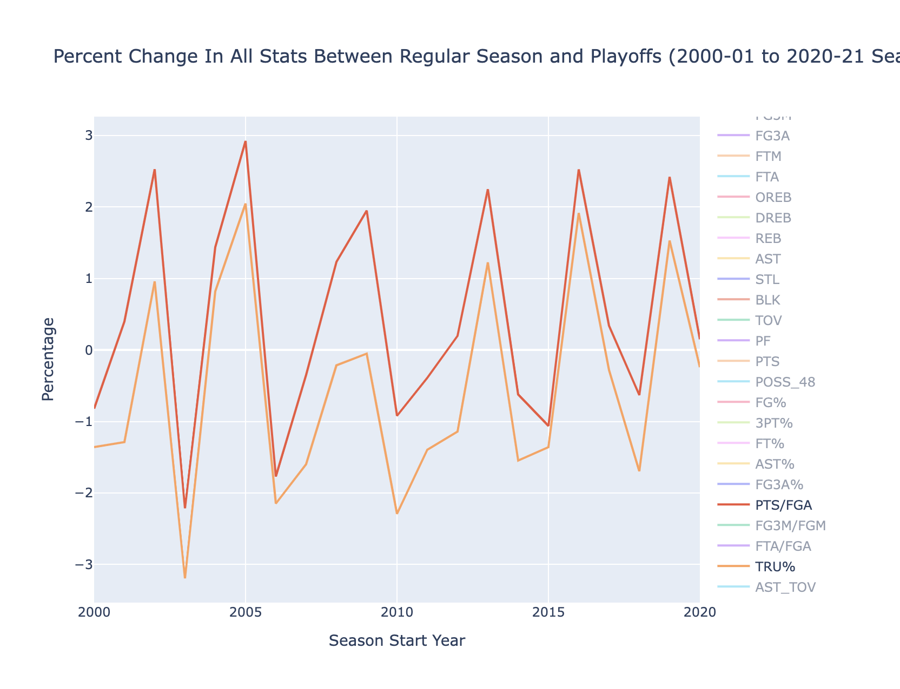

# NBA Data Scraper and Analyzer
##### Shlok Yeolekar
##### June 2024

## Description
This project is a Python-based tool to scrape, clean, and visualize NBA player statistics. You can choose a range 
of seasons starting from 1951 to present. The tool retrieves data from the NBA's official stats API, and generates 
interactive visualizations to help understand trends and changes in the game over time.

## Instructions
- Ignore the testing files
- Run NBA_analysis.py in any IDE or CLI

## Generated Graphs Include: 
- Correlation heatmaps
- Distribution of minutes played during reg. season vs. playoffs
- Changes in stats per 48 minutes and per 100 possessions over the years
- Comparison of regular season and playoff performance

## Requirements
Python 3 with the following packages: 
- pandas
- requests
- numpy
- openpyxl
- plotly

## Screenshots

